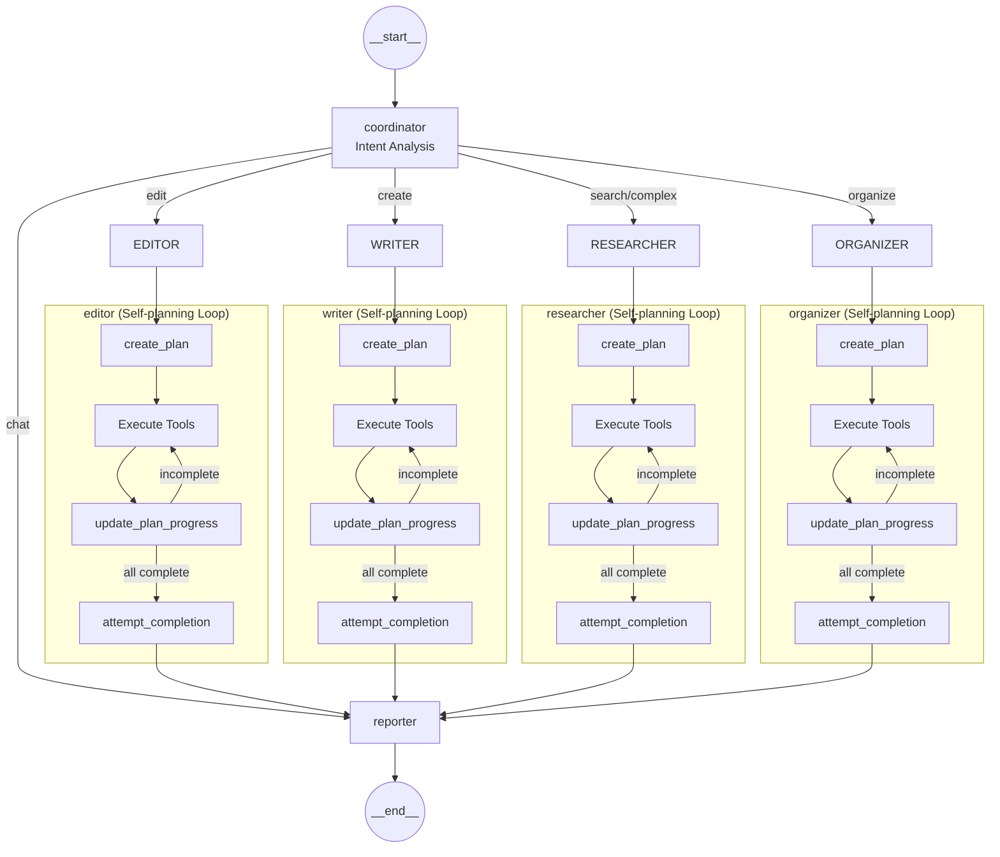
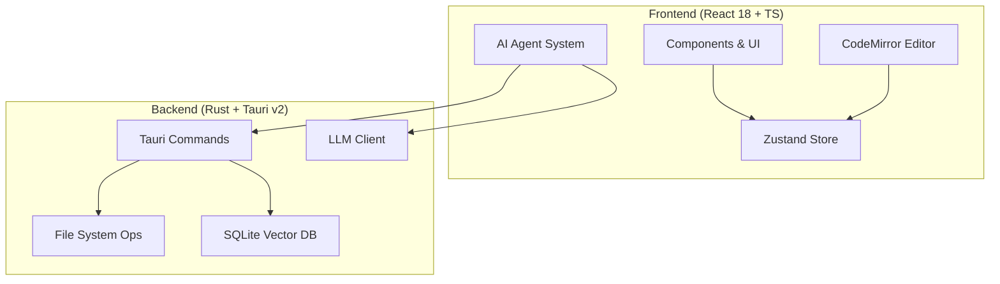

<div align="center">


# Lumina Note

**Local-first · AI-powered · Modern Knowledge Base**

Build your second brain with a Markdown note app deeply integrated with AI Agents.

[](https://tauri.app/)
[](https://react.dev/)
[](https://www.rust-lang.org/)
[](LICENSE)

**Language**: [简体中文](./README.md) · English · [日本語](./README.ja.md)

[Quick Start](#quick-start) · [Features](#core-features) · [Usage Guide](#usage-guide) · [Architecture](#architecture)

</div>

---

## Screenshots

<p align="center">
  
  <br/>
  <em>AI Agent - Deep Search & Note Summarization</em>
</p>

<p align="center">
  
  <br/>
  <em>Knowledge Graph - Visualize Note Connections</em>
</p>

<p align="center">
  
  <br/>
  <em>Editor - LaTeX Formulas & Backlinks</em>
</p>

---

## Core Features

Lumina Note is not just an editor - it's an LLM-native knowledge workspace.

### Immersive Editing

- **Multi-mode switching**: Seamlessly switch between Source / Live Preview / Reading modes
- **Bidirectional links**: Use `[[WikiLinks]]` to build a graph-like knowledge network, supports drag-and-drop from file tree
- **Professional formatting**: Native support for LaTeX math, Mermaid diagrams, and Obsidian-style `> [!info]` callouts
- **Syntax highlighting**: Based on CodeMirror 6, supports hundreds of languages
- **Split view editing**: Horizontal/vertical split, draggable resize, active pane auto-receives new files
- **Image paste**: `Ctrl+V` to paste screenshots directly, auto-saved to vault

### Knowledge Graph

Canvas-based high-performance visualization engine for intuitive display of note relationships.

- **Folder hierarchy**: Folders displayed as nodes (spiky ball style), parent-child relationships with arrow connections
- **Color zones**: Auto-assigned colors by folder, child nodes inherit parent folder color
- **Bidirectional links**: `[[WikiLinks]]` automatically parsed as connections between nodes
- **Right-click isolated view**: Right-click any node to view it and its direct connections in a new tab
- **Physics engine**: Adjustable repulsion, elasticity, centripetal force parameters, supports node dragging and canvas zoom

### AI Agent System

- **Agent mode**: Understands intent, automatically executes complex task chains like reading, editing, searching notes
- **AI floating ball**: Always-available assistant, draggable, doesn't interrupt your flow
- **Voice input**: Web Speech API-based speech-to-text, streaming display, auto-stop, recording animation
- **Diff preview**: Provides diff comparison view before AI modifications, you decide whether to apply
- **RAG semantic search**: Built-in SQLite vector database, semantic retrieval of your local knowledge base

#### Agent Architecture

The system uses intent-driven + Agent self-planning architecture. Coordinator analyzes intent and routes to specialized Agents, each Agent has a complete plan-execute-supervise loop internally.



Core mechanisms:
- **Self-planning**: Agent first calls `create_plan` to decompose task into 1-5 steps
- **Self-execution**: Loop calls tools to execute each step
- **Self-supervision**: `attempt_completion` checks plan completion, refuses to end if incomplete

Agent Toolset (18 tools):

| Category | Tools |
| :--- | :--- |
| Plan | `update_plan` |
| Read | `read_note`, `read_outline`, `read_section` |
| Write | `edit_note`, `create_note` |
| Search | `list_notes`, `search_notes`, `grep_search`, `semantic_search`, `fast_search` |
| Organize | `move_note`, `delete_note` |
| Database | `query_database`, `add_database_row` |
| Other | `get_backlinks`, `ask_user`, `attempt_completion` |

### Bilibili Video Notes

Take notes while watching videos, precise timestamp recording through danmaku sync.

- **Embedded playback**: Play Bilibili videos directly in the app, supports login and sending danmaku
- **Danmaku sync**: Send prefixed danmaku (e.g., `#note content`), one-click sync to timestamped notes
- **Time jump**: Click note timestamp, video auto-jumps to corresponding position (no refresh needed)
- **Auto-save**: Notes auto-saved as Markdown files, auto-loaded when opening the same video next time

### PDF Intelligent Reader

PDF reading and annotation system optimized for academic workflows.

- **Interactive element recognition**: Auto-detect text, images, tables, supports hover highlight and click selection
- **PDF annotation system**: Add highlight/underline to selected text, supports 5 colors and notes
- **Annotation sync**: Annotations auto-saved as Markdown files, same directory as PDF
- **Bidirectional jump**: Click links in notes to jump to PDF location, Ctrl+Click opens in split view
- **Thumbnails & outline**: Sidebar shows page thumbnails and document outline for quick navigation
- **Full-text search**: Search keywords in PDF, real-time highlight of matches
- **AI chat**: Send selected PDF content to AI for summarization, translation, or explanation

### Theme System

- **15 official themes**: Default/Ocean/Forest/Lavender/Rose/Sunset/Mint/Indigo/Latte/Aurora/Minimal etc.
- **Light & dark modes**: Each theme has both light and dark modes (30 looks total)
- **Markdown colors**: Themes affect 17 elements including headings/links/code blocks/quotes
- **Settings panel**: Gear icon in bottom-left, unified management of themes, AI, RAG settings

### Multi-model Ecosystem

Supports mainstream LLM Providers, freely switch models:

Anthropic · OpenAI · Gemini · DeepSeek · Moonshot · Groq · OpenRouter · Ollama (Local)

---

## Architecture

This project uses a Rust + React frontend-backend separation architecture, bridged through Tauri v2 for native capabilities.



### Tech Stack

- **Core**: Tauri v2
- **UI**: React 18, Tailwind CSS, Radix UI
- **Editor**: CodeMirror 6
- **State**: Zustand
- **Database**: SQLite (Vector Extension)
- **Lang**: TypeScript, Rust

---

## Quick Start

### Prerequisites

- Node.js 18.0+
- Rust 1.70+
- npm or pnpm

### Installation

1. Clone the repository

```bash
git clone https://github.com/blueberrycongee/Lumina-Note.git
cd Lumina-Note
```

2. Install dependencies

```bash
npm install
```

3. Run in development mode

```bash
npm run tauri dev
```

4. Build production package

```bash
npm run tauri build
```

### PDF Element Recognition (Optional)

To use PDF intelligent recognition (interactive element selection), start the backend parsing service:

1. Install Python dependencies (first time only)

```bash
cd scripts
pip install flask flask-cors pymupdf
```

2. Start PDF parsing service

```bash
python simple_pdf_server.py
```

Service will start at `http://localhost:8080`.

3. Usage in app
   - Open any PDF file
   - Click "Interactive Mode" button (lightning icon) in top-right
   - Hover over text/images to see highlights
   - Click elements to select, Ctrl+click for multi-select
   - Right panel allows copying references or chatting with AI

Advanced option: For more precise layout analysis (tables, formula recognition), use PP-Structure:

```bash
cd scripts
pip install -r requirements-pp-structure.txt
python pp_structure_server.py
```

See [docs/PP_STRUCTURE_SETUP.md](docs/PP_STRUCTURE_SETUP.md) for details.

---

## Usage Guide

### First Use

1. **Choose Workspace (Vault)**:
   - Select a folder as your note library on first launch
   - Recommend choosing a dedicated notes folder, avoid large directories (like entire Documents)
   - Too many files will slow down indexing, affecting AI semantic search performance
   - Recommended: Create a dedicated folder like `MyNotes` or `Vault`

2. **Interface Layout**:
   - Left sidebar: File tree, search, quick note buttons
   - Center area: Editor/PDF reader/Knowledge graph
   - Right sidebar: AI chat, outline, backlinks, tags
   - Bottom-left: Settings button (gear icon)

### Basic Editing

1. **Create note**: Click sidebar `+` button or use `Ctrl+N`
2. **Switch edit mode** (click top-right buttons):
   - Source mode: Shows raw Markdown syntax
   - Live preview: See rendered output while writing (recommended for daily use)
   - Reading mode: Pure reading view, no editing distractions
3. **Bidirectional links**: Type `[[` to trigger note linking, auto-completes existing notes
4. **Tags**: Use `#tagname` to add tags to notes

### Daily Quick Notes

- Click the calendar icon button in sidebar
- Notes auto-named as `Quick_2025-12-02_06-00.md` (with timestamp)
- Perfect for capturing ideas, meeting notes, temporary notes
- Auto-opens for editing after creation

### Voice Notes

- Click the microphone icon button in sidebar
- Voice converted to text in real-time, streaming display in editor
- Auto-stops recording after 3 seconds of silence
- Button shows dynamic ripple effect while recording
- Based on browser Web Speech API, no extra installation needed

### Knowledge Graph

1. **Open graph**: Click network icon in sidebar or use command palette
2. **Node interactions**:
   - Single-click node: Jump to corresponding note
   - Drag node: Adjust node position
   - Right-click node: Open isolated view (only shows that node and its connections)
   - Scroll wheel: Zoom in/out
3. **Graph features**:
   - Folders displayed as spiky ball style
   - Auto-colored by folder, child files inherit color
   - `[[WikiLinks]]` auto-parsed as connections between nodes
   - Physics engine simulation, nodes naturally cluster

### Theme Settings

1. Open settings: Click gear icon in bottom-left
2. Switch theme: Select theme in settings panel
3. 15 official themes: Default, Ocean, Forest, Lavender, Rose, Sunset, Mint, Indigo, Latte, Aurora, Minimal, etc.
4. Light/dark modes: Each theme has both light and dark modes
5. Quick toggle: Click sun/moon icon in title bar to quickly switch light/dark

### Using AI Assistant

1. **Configure API Key**:
   - Click settings icon in bottom-left → AI Settings
   - Select model provider, enter your API Key
   - Click save

2. **Entry points (3) - all support Chat / Agent modes**:
   - **Right AI panel**: Switch to AI Tab in right sidebar, chat or use Agent in current note context
   - **Floating ball**: Enable "Floating ball mode" in settings, a draggable AI button appears on screen, invoke Chat / Agent anytime
   - **Main view AI mode (left Ribbon button)**: Click AI icon in left function bar to open a full-screen AI view in main editing area, suitable for long conversations or complex Agent tasks

3. **RAG semantic search**:
   - Enable RAG indexing in settings
   - AI can semantically search your entire note library to answer questions
   - First indexing may be slow, recommend keeping note library not too large

### PDF Annotations

1. Open PDF: Click PDF file from file tree
2. Add annotation: Select text → popup toolbar → choose highlight color or add note
3. Annotation file: Auto-saved as `filename.annotations.md`
4. Jump:
   - Normal click `[Jump]` link: Opens PDF in main view
   - Ctrl+Click: Opens PDF in split view and jumps to position

### Split View Editing

1. Enable split: Click split button in toolbar
2. Switch active panel: Click left/right panel, highlighted border indicates current active
3. Open file to active panel: Click file from sidebar, opens in active panel
4. Resize: Drag middle divider

### Bilibili Video Notes

1. Open video: Paste Bilibili video link in note, click play button
2. Record notes: Send danmaku with `#` prefix, auto-syncs to timestamped notes
3. Time jump: Click timestamp in notes, video auto-jumps

### Database (Dataview Style)

1. Create database: Create `.db.json` file to define column structure
2. Add data: Add `db: databaseID` in note YAML frontmatter
3. Views: Supports table view and kanban view
4. Edit: Edit directly in table/kanban, auto-syncs back to note files

---

## Roadmap

### Completed

- [x] Multi LLM Provider support (8 providers)
- [x] AI Agent system with tool calling (4 modes + 14 tools)
- [x] Local vector database with semantic search (supports Reranker)
- [x] AI floating ball with streaming response
- [x] Bilibili video notes (embedded WebView + danmaku sync)
- [x] Speech-to-text (streaming display + auto-stop + recording animation)
- [x] 15 official themes + Markdown color customization
- [x] Central modal settings panel
- [x] PDF intelligent reader (element recognition + interactive selection + AI chat)
- [x] PDF annotations: highlight/underline/notes, Markdown storage, bidirectional jump
- [x] Split editing: resizable split panes, active panel tracking
- [x] Database: Dataview-style YAML-driven, table/kanban views
- [x] Image paste: Paste screenshots directly to editor, auto-save to vault
- [x] Drag-and-drop links: Drag files from tree to editor, auto-insert `[[WikiLink]]`
- [x] WebDAV sync: Support Jianguoyun and other WebDAV services, bidirectional vault sync
- [x] Flashcard system: Generate flashcards from notes, spaced repetition review (basic/cloze/MCQ)
- [x] Multi-language support: Chinese/English/Traditional Chinese/Japanese i18n
- [x] Dynamic routing: Intent recognition + multi-model routing, smart task distribution
- [x] Backlinks panel: Show which notes reference current note, click to navigate
- [x] Tag aggregation: Tag list + count + expand to view related notes
- [x] Export PDF: One-click export notes to PDF files

### In Progress

- [ ] PDF Rust migration: Port Python parsing service to Rust (eliminate external dependencies)
- [ ] Calendar view: Database calendar view

### Planned

- [ ] Template system: Choose preset templates when creating new notes
- [ ] Export HTML/Word: More export formats
- [ ] Plugin system: Plugin API design
- [ ] Git sync: Git version control integration
- [ ] Mobile: iOS / Android adaptation

---

## Project Structure

```
lumina-note/
├── src/
│   ├── agent/           # AI Agent core logic (Core, Tools, Prompts)
│   ├── components/      # React UI components
│   │   ├── layout/      # Layout components
│   │   ├── chat/        # Chat components
│   │   ├── ai/          # AI components
│   │   ├── search/      # Search components
│   │   ├── toolbar/     # Toolbar components
│   │   └── effects/     # Effect components
│   ├── editor/          # CodeMirror editor config and extensions
│   ├── services/        # LLM client and RAG service layer
│   ├── hooks/           # Custom React Hooks
│   └── stores/          # Zustand state management
├── src-tauri/
│   └── src/
│       ├── commands/    # Rust commands exposed to frontend
│       ├── fs/          # File system operations
│       └── vector_db/   # SQLite vector storage logic
├── scripts/             # Python backend services
└── package.json
```

---

## Contributors

<a href="https://github.com/blueberrycongee/Lumina-Note/graphs/contributors">
  
</a>

---

## License

This project is open-sourced under the [Apache License 2.0](LICENSE).
