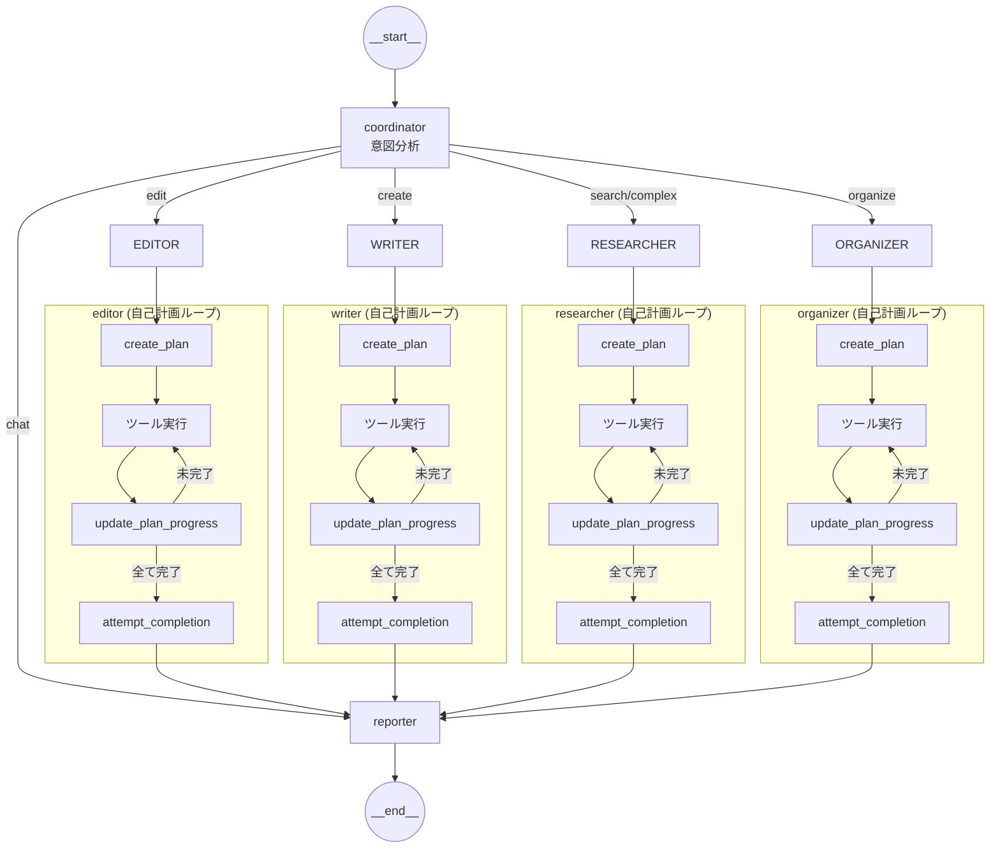
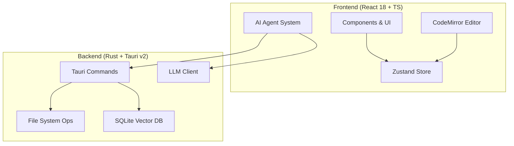

<div align="center">


# Lumina Note

**ローカル優先 · AI 駆動 · モダンなナレッジベース**

AI Agent を統合した Markdown ノートアプリで、あなたの第二の脳を構築しましょう。

[](https://tauri.app/)
[](https://react.dev/)
[](https://www.rust-lang.org/)
[](LICENSE)

**Language**: [简体中文](./README.md) · [English](./README.en.md) · 日本語

[クイックスタート](#クイックスタート) · [機能](#主な機能) · [使用ガイド](#使用ガイド) · [アーキテクチャ](#アーキテクチャ)

</div>

---

## スクリーンショット

<p align="center">
  
  <br/>
  <em>AI Agent - 深層検索とノート要約</em>
</p>

<p align="center">
  
  <br/>
  <em>ナレッジグラフ - ノート間の関連を可視化</em>
</p>

<p align="center">
  
  <br/>
  <em>エディター - LaTeX 数式とバックリンク</em>
</p>

---

## 主な機能

Lumina Note は単なるエディターではありません。LLM ネイティブなナレッジワークスペースです。

### 没入型編集体験

- **マルチモード切り替え**：ソース / ライブプレビュー / 閲覧モードをシームレスに切り替え
- **双方向リンク**：`[[WikiLinks]]` でグラフ型ナレッジネットワークを構築、ファイルツリーからのドラッグ＆ドロップ対応
- **プロフェッショナルなフォーマット**：LaTeX 数式、Mermaid 図、Obsidian スタイルの `> [!info]` コールアウトをネイティブサポート
- **シンタックスハイライト**：CodeMirror 6 ベース、数百の言語に対応
- **分割ビュー編集**：水平/垂直分割、ドラッグでリサイズ、アクティブペインが新しいファイルを自動受信
- **画像貼り付け**：`Ctrl+V` でスクリーンショットを直接貼り付け、自動でボールトに保存

### ナレッジグラフ

Canvas ベースの高性能可視化エンジンで、ノート間の関連を直感的に表示。

- **フォルダ階層**：フォルダはノードとして表示（トゲトゲボールスタイル）、親子関係は矢印で接続
- **カラーゾーン**：フォルダごとに自動で色を割り当て、子ノードは親フォルダの色を継承
- **双方向リンク**：`[[WikiLinks]]` は自動的にノード間の接続として解析
- **右クリック孤立ビュー**：任意のノードを右クリックして、そのノードと直接接続のみを新しいタブで表示
- **物理エンジン**：調整可能な斥力、弾力、向心力パラメータ、ノードのドラッグとキャンバスズームをサポート

### AI Agent システム

- **Agent モード**：意図を理解し、ノートの読み取り、編集、検索などの複雑なタスクチェーンを自動実行
- **AI フローティングボール**：いつでも呼び出せるアシスタント、ドラッグ可能、作業フローを中断しない
- **音声入力**：Web Speech API ベースの音声テキスト変換、ストリーミング表示、自動停止、録音アニメーション
- **Diff プレビュー**：AI 修正前に Diff 比較ビューを提供、適用するかどうかはあなたが決定
- **RAG セマンティック検索**：内蔵 SQLite ベクトルデータベース、ローカルナレッジベースのセマンティック検索

#### Agent アーキテクチャ

システムは意図駆動 + Agent 内自己計画アーキテクチャを採用。Coordinator が意図を分析して専門 Agent にルーティング、各 Agent は内部で完全な計画-実行-監督ループを持つ。



コアメカニズム：
- **自己計画**：Agent はまず `create_plan` を呼び出してタスクを 1-5 ステップに分解
- **自己実行**：ループでツールを呼び出して各ステップを実行
- **自己監督**：`attempt_completion` が計画の完了度をチェック、未完了の場合は終了を拒否

Agent ツールセット（18 ツール）：

| カテゴリ | ツール |
| :--- | :--- |
| 計画 | `update_plan` |
| 読み取り | `read_note`, `read_outline`, `read_section` |
| 書き込み | `edit_note`, `create_note` |
| 検索 | `list_notes`, `search_notes`, `grep_search`, `semantic_search`, `fast_search` |
| 整理 | `move_note`, `delete_note` |
| データベース | `query_database`, `add_database_row` |
| その他 | `get_backlinks`, `ask_user`, `attempt_completion` |

### Bilibili 動画ノート

動画を見ながらノートを取り、弾幕同期で正確なタイムスタンプを記録。

- **埋め込み再生**：アプリ内で Bilibili 動画を直接再生、ログインと弾幕送信をサポート
- **弾幕同期**：プレフィックス付き弾幕を送信（例：`#ノート内容`）、ワンクリックでタイムスタンプ付きノートに同期
- **時間ジャンプ**：ノートのタイムスタンプをクリック、動画が対応位置に自動ジャンプ（リフレッシュ不要）
- **自動保存**：ノートは Markdown ファイルとして自動保存、次回同じ動画を開くと自動ロード

### PDF インテリジェントリーダー

学術ワークフロー向けに最適化された PDF 閲覧・注釈システム。

- **インタラクティブ要素認識**：テキスト、画像、表などを自動検出、ホバーハイライトとクリック選択をサポート
- **PDF 注釈システム**：選択テキストにハイライト/下線を追加、5 色とノートをサポート
- **注釈同期**：注釈は Markdown ファイルとして自動保存、PDF と同じディレクトリ
- **双方向ジャンプ**：ノート内のリンクをクリックして PDF の位置にジャンプ、Ctrl+Click で分割ビューで開く
- **サムネイルとアウトライン**：サイドバーにページサムネイルとドキュメントアウトラインを表示、クイックナビゲーション
- **全文検索**：PDF 内でキーワード検索、マッチ結果をリアルタイムハイライト
- **AI チャット**：選択した PDF コンテンツを AI に送信して要約、翻訳、説明

### テーマシステム

- **15 の公式テーマ**：デフォルト/オーシャン/フォレスト/ラベンダー/ローズ/サンセット/ミント/インディゴ/ラテ/オーロラ/ミニマルなど
- **ライト＆ダークモード**：各テーマにライトとダークの両モード（計 30 種類の外観）
- **Markdown カラー**：テーマは見出し/リンク/コードブロック/引用など 17 要素に影響
- **設定パネル**：左下の歯車アイコン、テーマ、AI、RAG 設定を統一管理

### マルチモデルエコシステム

主流の LLM Provider に対応、自由にモデルを切り替え：

Anthropic · OpenAI · Gemini · DeepSeek · Moonshot · Groq · OpenRouter · Ollama (Local)

---

## アーキテクチャ

本プロジェクトは Rust + React のフロントエンド・バックエンド分離アーキテクチャを採用、Tauri v2 でネイティブ機能をブリッジ。



### 技術スタック

- **Core**: Tauri v2
- **UI**: React 18, Tailwind CSS, Radix UI
- **Editor**: CodeMirror 6
- **State**: Zustand
- **Database**: SQLite (Vector Extension)
- **Lang**: TypeScript, Rust

---

## クイックスタート

### 必要条件

- Node.js 18.0+
- Rust 1.70+
- npm または pnpm

### インストール手順

1. リポジトリをクローン

```bash
git clone https://github.com/blueberrycongee/Lumina-Note.git
cd Lumina-Note
```

2. 依存関係をインストール

```bash
npm install
```

3. 開発モードで実行

```bash
npm run tauri dev
```

4. 本番パッケージをビルド

```bash
npm run tauri build
```

### PDF 要素認識機能（オプション）

PDF インテリジェント認識機能（インタラクティブ要素選択）を使用するには、バックエンド解析サービスを起動：

1. Python 依存関係をインストール（初回のみ）

```bash
cd scripts
pip install flask flask-cors pymupdf
```

2. PDF 解析サービスを起動

```bash
python simple_pdf_server.py
```

サービスは `http://localhost:8080` で起動。

3. アプリでの使用方法
   - 任意の PDF ファイルを開く
   - 右上の「インタラクティブモード」ボタン（稲妻アイコン）をクリック
   - テキスト/画像にホバーするとハイライトが表示
   - 要素をクリックして選択、Ctrl+クリックで複数選択
   - 右パネルで参照をコピーまたは AI とチャット

上級オプション：より正確なレイアウト分析（表、数式認識）には PP-Structure を使用：

```bash
cd scripts
pip install -r requirements-pp-structure.txt
python pp_structure_server.py
```

詳細は [docs/PP_STRUCTURE_SETUP.md](docs/PP_STRUCTURE_SETUP.md) を参照。

---

## 使用ガイド

### 初回使用

1. **ワークスペース（Vault）を選択**：
   - 初回起動時にノートライブラリとしてフォルダを選択
   - 専用のノートフォルダを選択することを推奨、大きなディレクトリ（Documents 全体など）は避ける
   - ファイルが多すぎるとインデックス作成が遅くなり、AI セマンティック検索のパフォーマンスに影響
   - 推奨：`MyNotes` や `Vault` などの専用フォルダを作成

2. **インターフェースレイアウト**：
   - 左サイドバー：ファイルツリー、検索、クイックノートボタン
   - 中央エリア：エディター/PDF リーダー/ナレッジグラフ
   - 右サイドバー：AI チャット、アウトライン、バックリンク、タグ
   - 左下：設定ボタン（歯車アイコン）

### 基本編集

1. **ノートを作成**：サイドバーの `+` ボタンをクリックまたは `Ctrl+N` を使用
2. **編集モードを切り替え**（右上のボタンをクリック）：
   - ソースモード：生の Markdown 構文を表示
   - ライブプレビュー：書きながらレンダリング結果を確認（日常使用に推奨）
   - 閲覧モード：純粋な閲覧ビュー、編集の邪魔なし
3. **双方向リンク**：`[[` を入力してノートリンクをトリガー、既存のノートを自動補完
4. **タグ**：`#タグ名` を使用してノートにタグを追加

### デイリークイックノート

- サイドバーのカレンダーアイコンボタンをクリック
- ノートは `Quick_2025-12-02_06-00.md`（タイムスタンプ付き）として自動命名
- アイデアのキャプチャ、会議メモ、一時的なノートに最適
- 作成後、編集用に自動で開く

### 音声ノート

- サイドバーのマイクアイコンボタンをクリック
- 音声がリアルタイムでテキストに変換、エディターにストリーミング表示
- 3 秒の無音後に録音が自動停止
- 録音中はボタンに動的な波紋エフェクトを表示
- ブラウザの Web Speech API ベース、追加インストール不要

### ナレッジグラフ

1. **グラフを開く**：サイドバーのネットワークアイコンをクリックまたはコマンドパレットを使用
2. **ノードインタラクション**：
   - シングルクリック：対応するノートにジャンプ
   - ノードをドラッグ：ノード位置を調整
   - 右クリック：孤立ビューを開く（そのノードと接続のみ表示）
   - スクロールホイール：ズームイン/アウト
3. **グラフの特徴**：
   - フォルダはトゲトゲボールスタイルで表示
   - フォルダごとに自動着色、子ファイルは色を継承
   - `[[WikiLinks]]` はノード間の接続として自動解析
   - 物理エンジンシミュレーション、ノードが自然にクラスタリング

### テーマ設定

1. 設定を開く：左下の歯車アイコンをクリック
2. テーマを切り替え：設定パネルでテーマを選択
3. 15 の公式テーマ：デフォルト、オーシャン、フォレスト、ラベンダー、ローズ、サンセット、ミント、インディゴ、ラテ、オーロラ、ミニマルなど
4. ライト/ダークモード：各テーマにライトとダークの両モード
5. クイック切り替え：タイトルバーの太陽/月アイコンをクリックしてライト/ダークを素早く切り替え

### AI アシスタントの使用

1. **API Key を設定**：
   - 左下の設定アイコンをクリック → AI 設定
   - モデルプロバイダーを選択、API Key を入力
   - 保存をクリック

2. **エントリーポイント（3 つ）- すべて Chat / Agent モードをサポート**：
   - **右側 AI パネル**：右サイドバーで AI タブに切り替え、現在のノートコンテキストでチャットまたは Agent を使用
   - **フローティングボール**：設定で「フローティングボールモード」を有効化、画面にドラッグ可能な AI ボタンが表示、いつでも Chat / Agent を呼び出し
   - **メインビュー AI モード（左リボンボタン）**：左機能バーの AI アイコンをクリックしてメイン編集エリアにフルスクリーン AI ビューを開く、長い会話や複雑な Agent タスクに最適

3. **RAG セマンティック検索**：
   - 設定で RAG インデックスを有効化
   - AI がノートライブラリ全体をセマンティック検索して質問に回答可能
   - 初回インデックスは遅い場合があるため、ノートライブラリは大きすぎないことを推奨

### PDF 注釈

1. PDF を開く：ファイルツリーから PDF ファイルをクリック
2. 注釈を追加：テキストを選択 → ポップアップツールバー → ハイライト色を選択またはノートを追加
3. 注釈ファイル：`ファイル名.annotations.md` として自動保存
4. ジャンプ：
   - 通常クリック `[ジャンプ]` リンク：メインビューで PDF を開く
   - Ctrl+Click：分割ビューで PDF を開いて位置にジャンプ

### 分割ビュー編集

1. 分割を有効化：ツールバーの分割ボタンをクリック
2. アクティブパネルを切り替え：左/右パネルをクリック、ハイライトされた境界線が現在のアクティブを示す
3. アクティブパネルにファイルを開く：サイドバーからファイルをクリック、アクティブパネルで開く
4. リサイズ：中央のディバイダーをドラッグ

### Bilibili 動画ノート

1. 動画を開く：ノートに Bilibili 動画リンクを貼り付け、再生ボタンをクリック
2. ノートを記録：`#` プレフィックス付き弾幕を送信、タイムスタンプ付きノートに自動同期
3. 時間ジャンプ：ノート内のタイムスタンプをクリック、動画が自動ジャンプ

### データベース（Dataview スタイル）

1. データベースを作成：`.db.json` ファイルを作成してカラム構造を定義
2. データを追加：ノートの YAML frontmatter に `db: データベースID` を追加
3. ビュー：テーブルビューとカンバンビューをサポート
4. 編集：テーブル/カンバンで直接編集、ノートファイルに自動同期

---

## ロードマップ

### 完了

- [x] マルチ LLM Provider サポート（8 プロバイダー）
- [x] ツール呼び出し機能を備えた AI Agent システム（4 モード + 14 ツール）
- [x] セマンティック検索付きローカルベクトルデータベース（Reranker サポート）
- [x] ストリーミングレスポンス付き AI フローティングボール
- [x] Bilibili 動画ノート（埋め込み WebView + 弾幕同期）
- [x] 音声テキスト変換（ストリーミング表示 + 自動停止 + 録音アニメーション）
- [x] 15 の公式テーマ + Markdown カラーカスタマイズ
- [x] 中央モーダル設定パネル
- [x] PDF インテリジェントリーダー（要素認識 + インタラクティブ選択 + AI チャット）
- [x] PDF 注釈：ハイライト/下線/ノート、Markdown ストレージ、双方向ジャンプ
- [x] 分割編集：リサイズ可能な分割ペイン、アクティブパネル追跡
- [x] データベース：Dataview スタイル YAML 駆動、テーブル/カンバンビュー
- [x] 画像貼り付け：スクリーンショットを直接エディターに貼り付け、自動でボールトに保存
- [x] ドラッグ＆ドロップリンク：ファイルツリーからエディターにドラッグして `[[WikiLink]]` を自動挿入
- [x] WebDAV 同期：堅果雲などの WebDAV サービスで双方向ボールト同期
- [x] フラッシュカードシステム：ノートからフラッシュカードを生成、間隔反復復習（基本/穴埋め/選択問題）
- [x] 多言語サポート：中国語/英語/繁体字中国語/日本語の国際化
- [x] ダイナミックルーティング：意図認識 + マルチモデルルーティング、スマートなタスク分配
- [x] バックリンクパネル：現在のノートを参照しているノートを表示、クリックでナビゲート
- [x] タグ集約：タグリスト + カウント、展開して関連ノートを表示
- [x] PDF エクスポート：ノートをワンクリックで PDF にエクスポート

### 進行中

- [ ] PDF Rust 移行：Python PDF 解析サービスを Rust に移植（外部依存を排除）
- [ ] カレンダービュー：データベースのカレンダービュー

### 計画中

- [ ] テンプレートシステム：新規ノート作成時にプリセットテンプレートを選択
- [ ] HTML/Word エクスポート：より多くのエクスポート形式
- [ ] プラグインシステム：プラグイン API 設計
- [ ] Git 同期：Git バージョン管理統合
- [ ] モバイル：iOS / Android 対応

---

## プロジェクト構造

```
lumina-note/
├── src/
│   ├── agent/           # AI Agent コアロジック (Core, Tools, Prompts)
│   ├── components/      # React UI コンポーネント
│   │   ├── layout/      # レイアウトコンポーネント
│   │   ├── chat/        # チャットコンポーネント
│   │   ├── ai/          # AI コンポーネント
│   │   ├── search/      # 検索コンポーネント
│   │   ├── toolbar/     # ツールバーコンポーネント
│   │   └── effects/     # エフェクトコンポーネント
│   ├── editor/          # CodeMirror エディター設定と拡張
│   ├── services/        # LLM クライアントと RAG サービス層
│   ├── hooks/           # カスタム React Hooks
│   └── stores/          # Zustand 状態管理
├── src-tauri/
│   └── src/
│       ├── commands/    # フロントエンドに公開する Rust コマンド
│       ├── fs/          # ファイルシステム操作
│       └── vector_db/   # SQLite ベクトルストレージロジック
├── scripts/             # Python バックエンドサービス
└── package.json
```

---

## コントリビューター

<a href="https://github.com/blueberrycongee/Lumina-Note/graphs/contributors">
  
</a>

---

## ライセンス

本プロジェクトは [Apache License 2.0](LICENSE) の下でオープンソースです。
